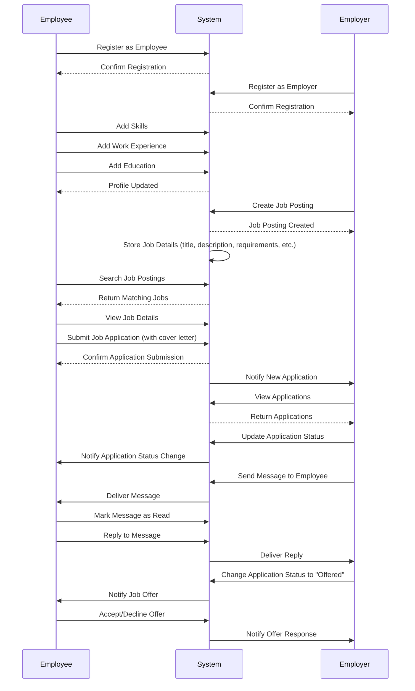

```mermaid
sequenceDiagram
    participant Employee
    participant System
    participant Employer
    
    %% User Registration Flows
    Employee->>System: Register as Employee
    System-->>Employee: Confirm Registration
    
    Employer->>System: Register as Employer
    System-->>Employer: Confirm Registration
    
    %% Employee Profile Setup
    Employee->>System: Add Skills
    Employee->>System: Add Work Experience
    Employee->>System: Add Education
    System-->>Employee: Profile Updated
    
    %% Employer Creates Job Posting
    Employer->>System: Create Job Posting
    System-->>Employer: Job Posting Created
    System->>System: Store Job Details (title, description, requirements, etc.)
    
    %% Job Search and Application
    Employee->>System: Search Job Postings
    System-->>Employee: Return Matching Jobs
    Employee->>System: View Job Details
    Employee->>System: Submit Job Application (with cover letter)
    System-->>Employee: Confirm Application Submission
    System->>Employer: Notify New Application
    
    %% Application Processing
    Employer->>System: View Applications
    System-->>Employer: Return Applications
    Employer->>System: Update Application Status
    System->>Employee: Notify Application Status Change
    
    %% Communication
    Employer->>System: Send Message to Employee
    System->>Employee: Deliver Message
    Employee->>System: Mark Message as Read
    Employee->>System: Reply to Message
    System->>Employer: Deliver Reply
    
    %% Job Offer
    Employer->>System: Change Application Status to "Offered"
    System->>Employee: Notify Job Offer
    Employee->>System: Accept/Decline Offer
    System->>Employer: Notify Offer Response
    
```